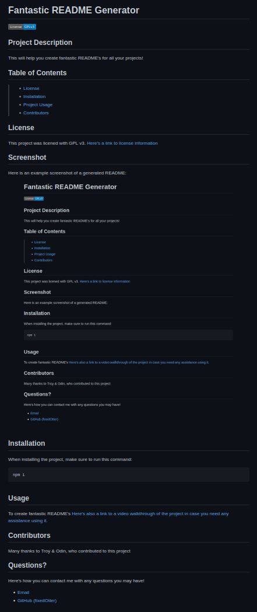

# Fantastic README Generator
[](https://www.gnu.org/licenses/gpl-3.0)

## Project Description
This will help you create fantastic README's for all your projects!

## Table of Contents
> * [License](#license)
> * [Installation](#installation)
> * [Project Usage](#usage)
> * [Contributors](#contributors)

## License
This project was licened with GPL v3. [Here's a link to license information](https://www.gnu.org/licenses/gpl-3.0)

## Screenshot
Here is an example screenshot of a generated README:


## Installation
When installing the project, make sure to run this command:
```
npm i
```

## Usage
To create fantastic README's
[Here's also a link to a video walkthrough of the project in case you need any assistance using it.](https://odysee.com/@fixedOtter:f/fantastic-README-maker:e?r=B4Y8MuDybpNxa3KDKGjAgTn6gVyNHUno)

## Contributors
Many thanks to Troy & Odin, who contributed to this project

## Questions?
Here's how you can contact me with any questions you may have!
* [Email](mailto:fo1152rc@go.minnstate.edu)
* [GitHub (fixedOtter)](https://github.com/fixedOtter)
